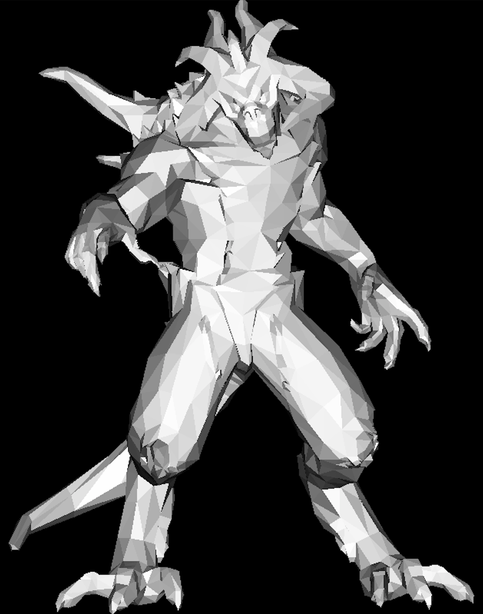
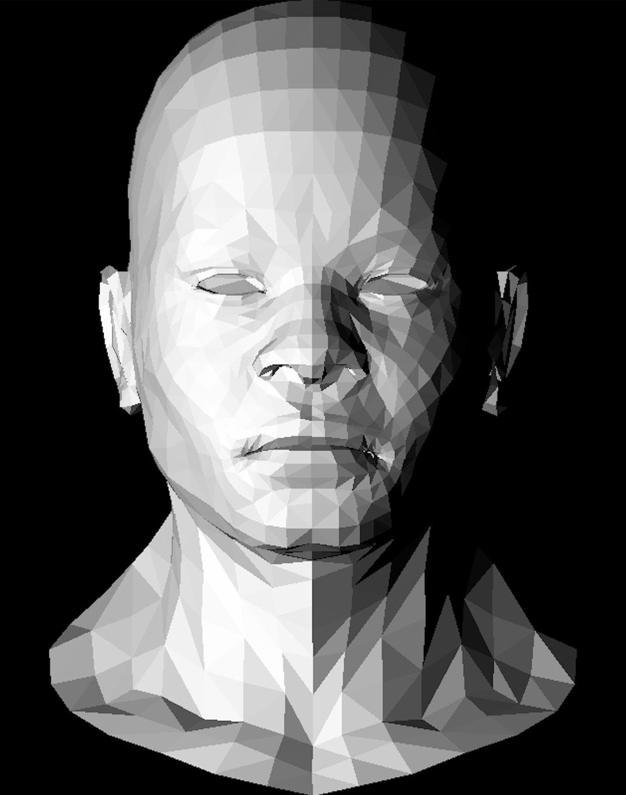
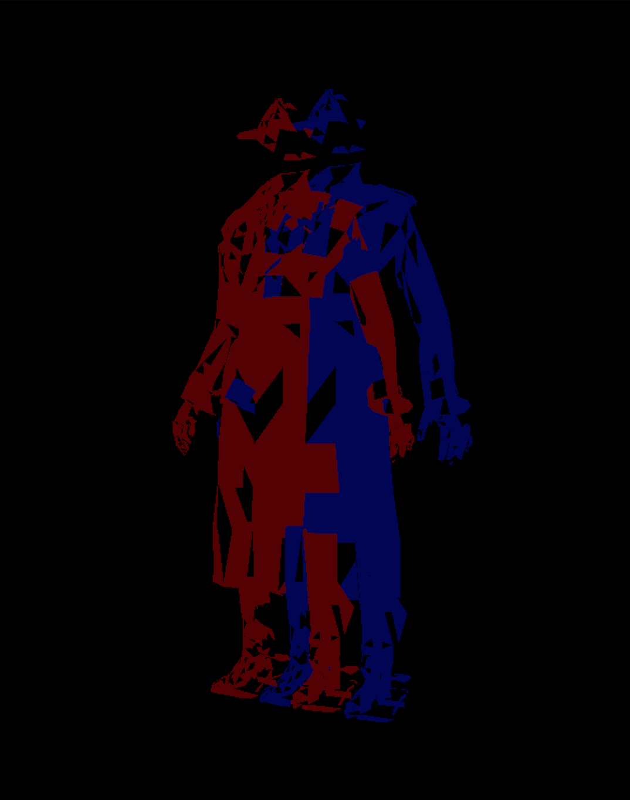
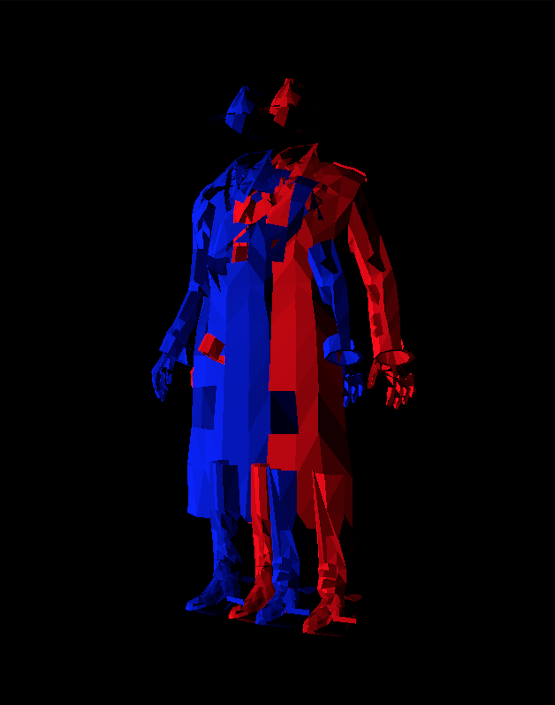
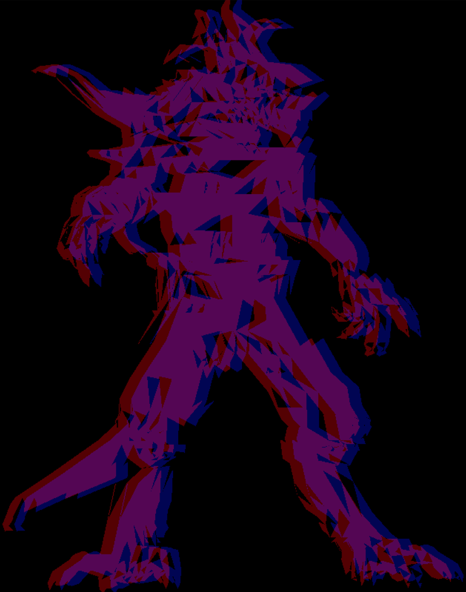

# RDV

COMPILATION :

make

./main .obj

Deux images générés :

  - 3D.tga (image en nuance de gris sans anaglyphe)
  - anaglyphe.tga (image en anaglyphe)

Affichage 3D :

Début de l'anaglyph avec les erreurs :

Anaglyph :

